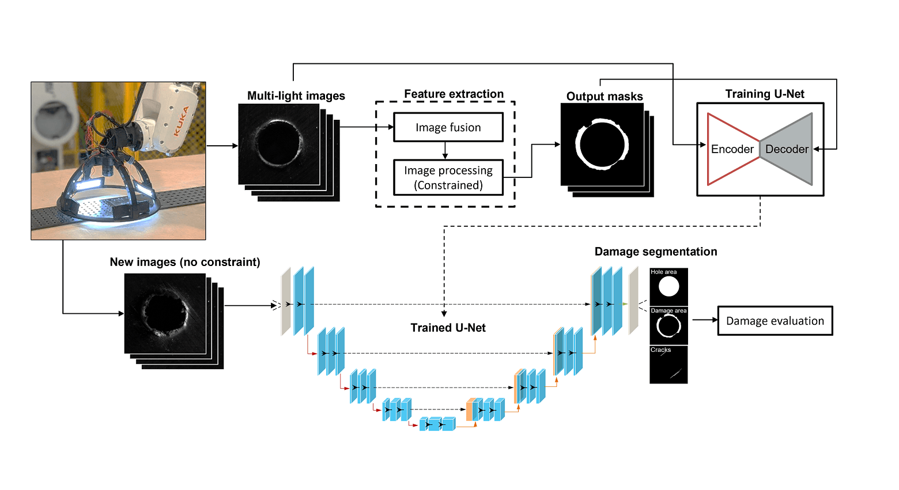

## Publication

**Authors:** Maghami, A., Salehi, M., and Khoshdarregi, M.

**Journal:** CIRP Journal of Manufacturing Science and Technology, 2021

## Overview

This work explores using computer vision and deep learning to automatically detect defects in drilled composite structures, making quality control faster and more consistent.

## Problem

Detecting microscopic defects around drilled holes in aerospace composites is time-consuming and inconsistent when done manually. We investigated whether automated vision could improve inspection processes.

## Approach

We developed a system using multiple light angles to reveal different types of defects, then trained deep learning models to recognize damage patterns and anomalies automatically.

## Results

The system achieved high accuracy for defect detection and significantly reduced inspection time compared to manual methods, with validation on real manufacturing samples.

## Application

This work demonstrates the potential for automating quality control in precision composite manufacturing, where visual inspection is critical but challenging to automate effectively.

