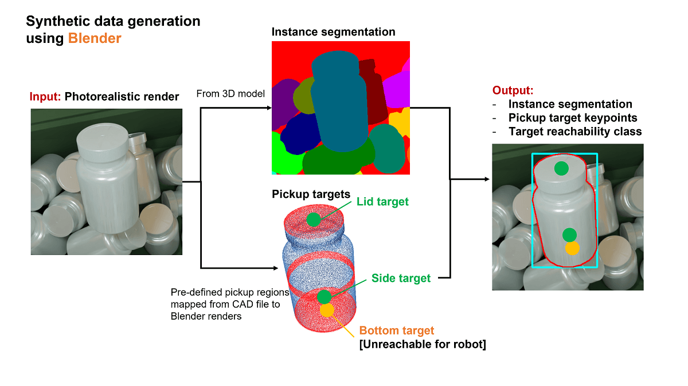
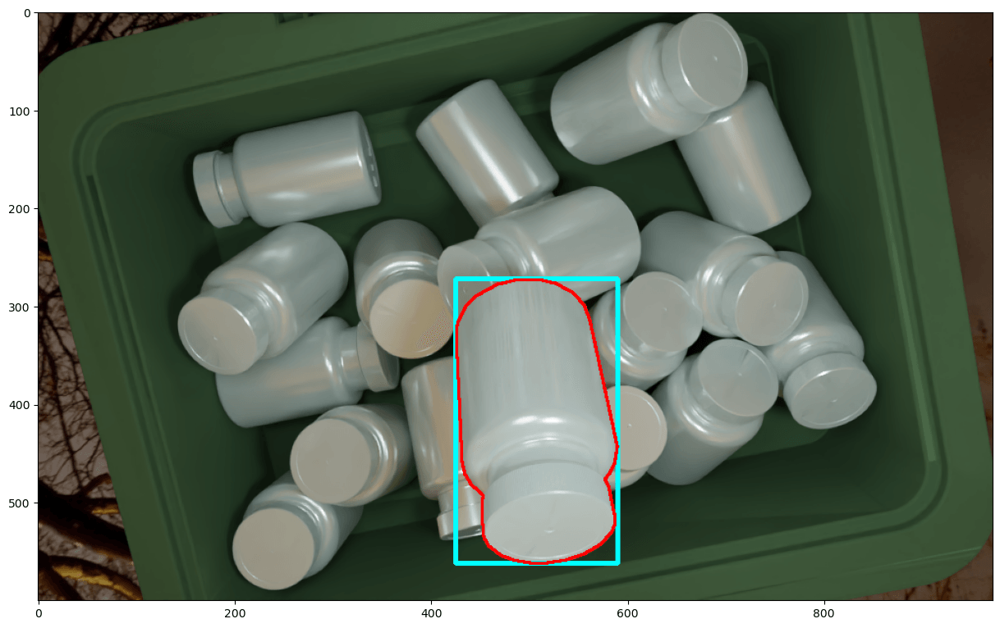
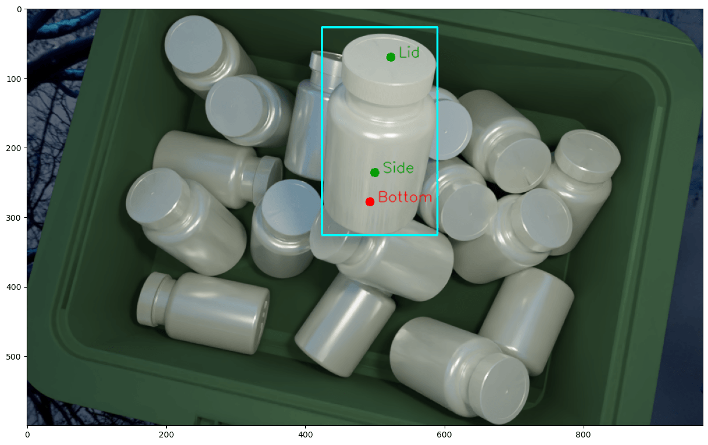
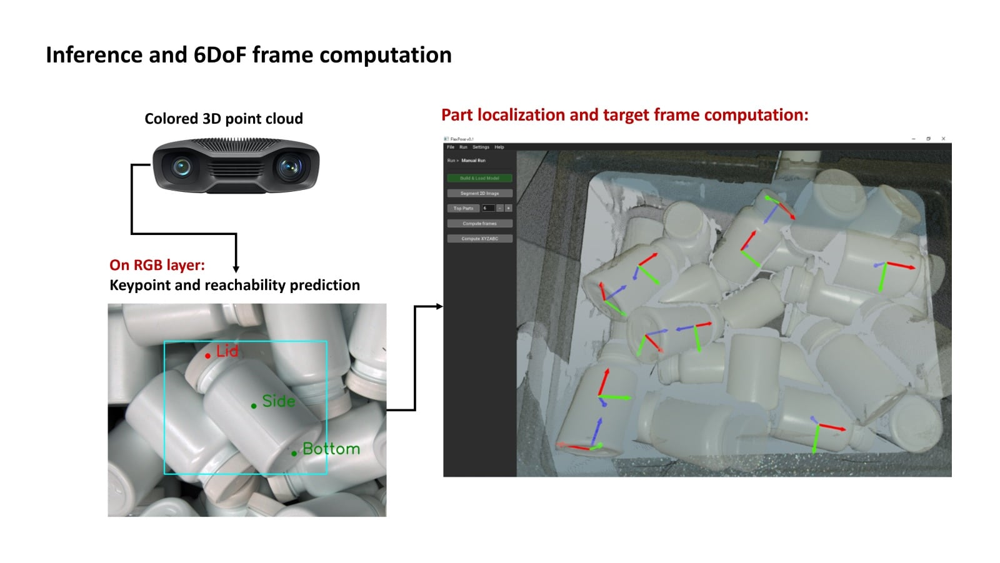
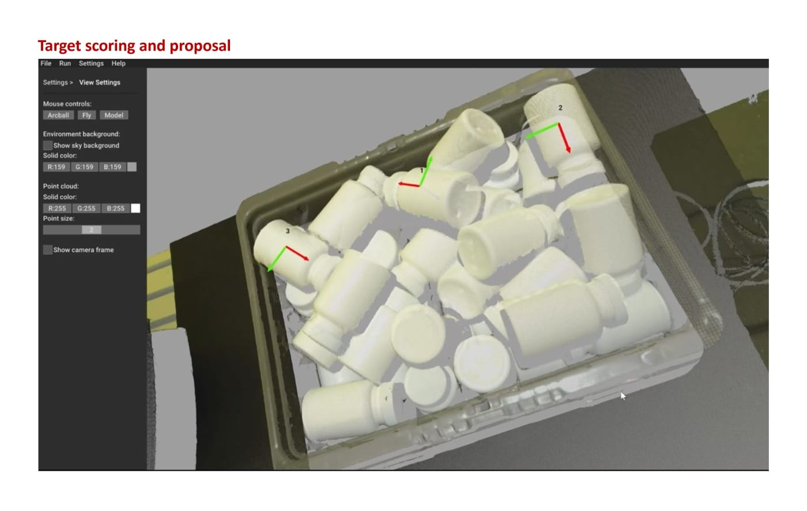

## Overview

Developed a complete 3D perception pipeline for robotic bin picking applications, leveraging synthetic data generation and deep learning for object localization and grasp planning.

Training data was generated entirely in Blender from CAD, with pre-defined lid, side and bottom pickup regions mapped onto each part and labelled by whether the robot could actually reach them.

## Domain Randomization

To close the gap between synthetic training data and the real bin, every render randomized camera intrinsics and pose, lighting direction, intensity, colour and count, background and environment, object materials, object pose and scene composition, and sensor and image effects.

## Contributions

- Built automated 3D data generation framework for training dataset creation
- Trained instance segmentation models on synthetic data for real-world transfer
- Implemented point-cloud processing for pose estimation and grasp planning
- Developed distributed client-server framework for parallel data generation

## Inference and Grasp Selection

At run time the RGB keypoint and reachability predictions are lifted onto the colored 3D point cloud to compute a 6DoF frame for each candidate part, which is then scored to propose the next pick.

## Technologies

PyTorch, Mask R-CNN, OpenCV, Open3D, Robot OS (ROS), Blender API, Python

